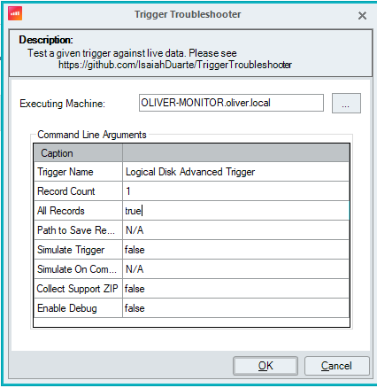

# Trigger Troubleshooter

Trigger Troubleshooter takes a trigger name, retrieves its filter, scope, and schedule, then performs a test on live data. It gathers data within the trigger’s scope, validates it against the defined filter/schedule, checks if the fields are being observed by the monitor, and displays the results.

## SBA

• Provide a trigger name to test against live data.  
• The script will:  
  – Download the latest TriggerTroubleshooter module from GitHub (unless an offline path is provided).  
  – Import the module.  
  – Run the Test-Trigger function.  
  – Optionally collect a Support Trigger Dump.

Notes:
- Only objects within the trigger’s scope are processed. To limit output, narrow the trigger’s scope.
- Using the "Process All Records" option may produce a large volume of output, depending on the trigger and scope.
- The "Records Per Folder" option takes a specified number of records from each folder. For instance, if you have 10 folders and choose 2 records per folder, up to 20 records will be processed (assuming each folder has at least 2 records).

## Supported Triggers (Pending Tests)

- Advanced Logical Disk  
- Advanced Folder  
- Advanced Session  
- Advanced Computer  
- Service 
- Events 
- User Logged Off  
- User Logged On  

## Example

### Trigger Configuration

### SBA Parameters

### SBA Result

