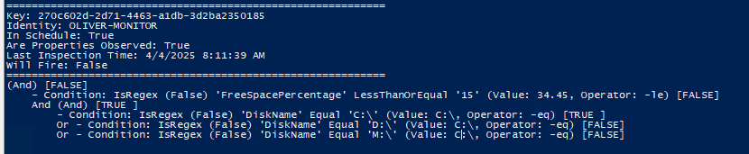

# Trigger Troubleshooter - The Test Button

Trigger Troubleshooter is a utility that takes a trigger name, retrieves its filter, scope, and schedule, and then performs a test on live data. It gathers data within the trigger's scope, validates it against the specified filter and schedule, checks if the relevant fields are being monitored, and displays the results.

Note: The results produced by this script do not guarantee that the trigger will fire, as there are many influencing factors. However, the results should be very close to what you can expect.

**Requirements:** Version 9.0.5 or later

--------------------------------------------------

## Script Action Overview

When you provide a trigger name, the script tests it against live data and reports the results. Here are some important points to note:

- **Scope Limitation:**  
  Only objects within the trigger's defined scope are processed. To limit the output, narrow the trigger’s scope as needed.

- **Output Volume:**  
  Choosing the "Process All Records" option might produce a large volume of output, depending on the trigger and its scope.

- **Record Limiting:**  
  The "Record" option allows you to specify a certain number of records to process.

- **Saving Results:**  
  You can save the output to a file by using the "Path to Save Results" parameter. This requires a fully qualified file path (e.g., C:\temp\output.txt).

--------------------------------------------------

## Simulate Trigger

Trigger Troubleshooter also offers the ability to simulate a trigger based on the one you provide. The simulation works by:

1. Sanitizing the columns available for simulation.
2. Creating a new trigger.
3. Simulating the conditions (for example, maximizing CPU usage) on the computer specified by the "Simulate on Computer" parameter.

### Supported Trigger Simulations

- **Advanced Machine Triggers:**  
  - CPU  
  - MemoryInUse  
  *Note: If both MemoryInUse and CPU columns are present, CPU will be chosen and MemoryInUse will be dropped.*

- **Windows Event Triggers:**  
  - Category  
  - EntryType  
  - EventID  
  - Log  
  - Message  
  - Source

- **Advanced Logical Disk Triggers:**  
  - DiskKBps  
  - DiskReadKBps  
  - DiskWriteKBps  
  - FreeSpacePercentage

### Expected Output for a Simulated Trigger

For a successful simulation, the output will look similar to:
```text
--------------------------------------------------
Simulation result: True
--------------------------------------------------
```

No follow-up actions will be taken on simulated triggers.

*Note:* For the "Simulate on Computer" parameter, provide the sName value from the Computers table. You can obtain this value using:  
(Get-CUComputers -Match "MyComputerName").Name

--------------------------------------------------

## Non-Supported Triggers

- Stress

--------------------------------------------------

## Example

Below are examples of the trigger configuration, script action parameters, and script action result screens.

### Trigger Configuration


### Script Action Parameters


### Script Action Result



--------------------------------------------------

## Result Header Explanation

- **Key:**  
  An internal table property representing any record.

- **Identity:**  
  A mapped field derived from the trigger that provides a unique identifier for the tested record.

- **In Schedule:**  
  Every trigger has an associated [schedule](https://support.controlup.com/docs/schedule-settings?highlight=Trigger%20Schedule). This field indicates whether the schedule aligns with the monitor’s current time.

- **Are Properties Observed:**  
  Checks whether the specified properties are being monitored by referring to the Observables Runtime table. Depending on the trigger type (e.g., Windows Event, Process Started, Process Stopped), this value might be false.

- **Last Inspection Time:**  
  The time when the monitor last evaluated the trigger.

- **Will Fire:**  
  Indicates whether the trigger conditions are met. If all conditions are met, this will be True.

## Setup
